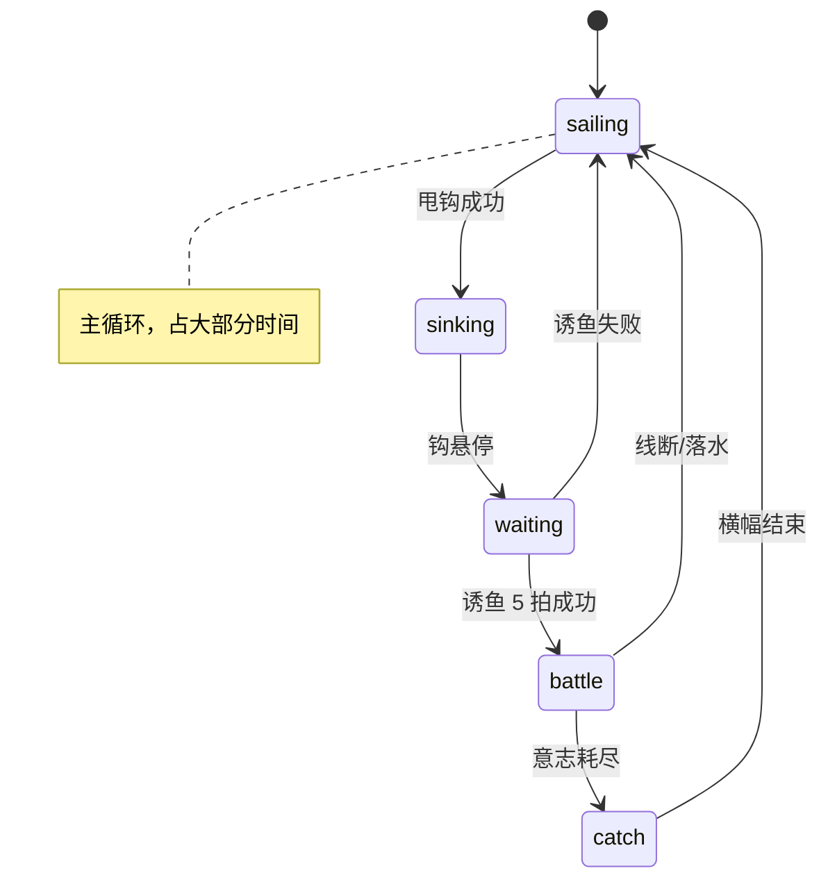

# 钓鱼节奏游戏 — 代码级设计说明

> 路径基准：`game/client/source/fishing/`  
> 主循环：`FishingScene.update()` → `StateMachine` → 各 `*State`  
> 时间基准：`BeatClock`（与 `AudioSystem` 底拍对齐，`performance.now()` 判定点）

---

## 1. 一局游戏在做什么

玩家驾驶小船**持续向前航行**（航程 `worldScrollPx`），在航行中按底拍**破浪 → 甩钩 → 诱鱼 → 拔河 → 起鱼**，每成功起鱼一条推进 **1 个 stage（共 15 关）**。  
难度、海域、视觉、天气随 stage / 航程加深；企鹅饥饿主要影响奖励与天气加成，**不再是天气主驱动**。



| 状态 | 文件 | 是否在用 |
|------|------|----------|
| `sailing` | `states/SailingState.ts` | ✅ 主循环入口 |
| `sinking` | `states/SinkingState.ts` | ✅ 钩下沉 |
| `waiting` | `states/WaitingState.ts` | ✅ 诱鱼 |
| `battle` | `states/BattleState.ts` | ✅ 拔河 |
| `catch` | `states/CatchState.ts` | ✅ 结算 |
| `hooked` | `states/HookedState.ts` | ⚠️ **已绕过**，主流程不再进入 |
| `casting` | `types.ts` 有 id | ❌ 无独立 State，甩钩在 `SailingState` 内 |

---

## 2. 关卡 / 进度（两套轴，易混）

### 2.1 Stage 轴 — `ProgressionSystem`

| 概念 | 代码 | 说明 |
|------|------|------|
| 关数 | `STAGE_COUNT = 15` | 每 **起鱼 1 条** `reportCatch()` → `stageIndex++` |
| 海域 zone | `zone = floor(index / 3)` | 5 档：`shallows → coast → deep → abyss → abyssDeep` |
| 海域横幅 | `consumeZoneUp()` | 仅 **跨 zone** 时在 `SailingState.enter` 播报 |
| 战斗数值 | `StageProfile` | `bpmBase`, `windowMul`, `noteCap`, `willpowerMul`, `strictnessFloor`… |
| 静态水深氛围 | `stage.depthMood` | 0..1，随 stage 里程碑变暗 |

```text
index:  0  1  2 | 3  4  5 | 6  7  8 | 9 10 11 | 12 13 14
zone:   [ shallows ] [ coast ] [ deep ] [ abyss ] [ abyssDeep ]
```

### 2.2 Voyage 轴 — 同文件 `updateVoyage()`

| 概念 | 代码 | 说明 |
|------|------|------|
| 像素航程 | `worldScrollPx` | 在 `sailing` / `sinking` / `waiting` 时以 ~140px/s×深度系数累加 |
| 归一化航程 | `voyage` 0..1 | `scroll / (viewportWidth × 4.5)` 与 leg 进度取 max |
| 用途 | `FishingScene` | 驱动 **海床滚动、船位离岸、水色、鱼种过滤** |

**结构问题（待优化）**：  
- **Stage**（起鱼推进）与 **Voyage**（航行时间推进）是两条独立深度轴，视觉主要靠 voyage，难度主要靠 stage。  
- 玩家可能「看起来已到深海」但 stage 仍浅，或反之。  
- 建议后续合并为单一 `runDepth` 或明确分工（例如 voyage 只管画面、stage 只管玩法）。

### 2.3 鱼种与委托

| 系统 | 文件 | 驱动 |
|------|------|------|
| 委托鱼 | `pickCommissionFish(hunger, zone)` | `SailingState.enter` |
| 咬钩鱼 | `pickFishForBite(weather, depth, zone)` | `WaitingState` |
| 海域过滤 | `fishEligibleForZone()` | `FishSchool.setStageZone` |

---

## 3. 节奏卡点（按状态）

全局判定（`PullPanel` / `LurePads` 共用）：

| 判定 | 窗口 |
|------|------|
| Perfect | ±90 ms |
| Good | ±200 ms |
| Miss | 超出 Good |

底拍检测：`BeatClock.phase()` 从 >0.6 跳到 <0.4，或相位回绕。

### 3.1 `SailingState` — 破浪 + 甩钩

| 阶段 | UI | 输入 | 节拍逻辑 |
|------|-----|------|----------|
| 破浪 | `PullPanel` mode=`wave`，左下圆钮 | 点击 / **空格** | **每个底拍**可点；Perfect/Good 破浪，Miss 偏航 |
| 甩钩窗口 | 累计 **4 个底拍** 后打开 | 同上 | mode=`cast`，持续 **2 底拍**；点在拍上 → `performCast` |
| 失败 | — | 偏航 `deviation≥1` 或 `waveSubmerge≥0.92` | 企鹅落水动画 → `reportSnap()` |

甩钩力度：`msFromNearestBeat` → `power` 0.5..1 → 钩的初速与深度。

### 3.2 `SinkingState`

无玩家输入；钩物理到达 `hover` → `WaitingState`。

### 3.3 `WaitingState` — 诱鱼（当前：纯底拍）

| 项 | 值 / 行为 |
|----|-----------|
| 成功条件 | **5 次** on-beat 双滑（`ROUNDS_TO_BITE`） |
| 失败上限 | 4 次（`MAX_FAILS`） |
| 每拍流程 | 底拍 → 企鹅举旗 + 哨声 + 开滑垫 → 玩家双滑；下一底拍前未滑 = 该轮失败 |
| 方向 | 左右交替；须与旗子一致 |
| UI | `LurePads` 左下/右下；拍点闪黄边 |
| 键盘 | 左：`A+←` 或 `A+S`；右：`D+→` 或 `D+W` |
| 视觉反馈 | `FishSchool.setLureGather` 鱼群聚集舞动；无 `EventOverlay` 节拍点（已去掉听一遍复现） |

### 3.4 `BattleState` — 拔河（已简化为纯底拍）

**与破浪 / 诱鱼同一节奏壳**：左下 `PullPanel` mode=`battle`，每个底拍点一次（空格同）。

| 条 | 机制 |
|----|------|
| **张力条（上）** | Perfect/Good 把白点拉向安全区；连续 **2 个底拍**未按准 → STRUGGLE（白点被推开）；出圈过久 → 断线 |
| **意志条（右）** | 每次 on-beat Perfect −7.5%、Good −4.2%；待在安全区内另有缓慢背景 drain |
| **Frenzy** | 安全区撑满仍保留：音乐层升高 + 企鹅绕圈 + 额外意志伤害 |
| **已移除** | `NoteLane` 音符轨、`EventOverlay` follow/run 加强拍、美人鱼事件 |

判定窗口与全局一致：Perfect ±90ms，Good ±200ms。

### 3.5 `CatchState`

无节奏输入；横幅 → `fishCaught` 事件 → 回 `SailingState`。

---

## 4. 视觉与代码映射

### 4.1 渲染层级（`FishingScene`）

```text
skyContainer          SkyLayer, HorizonLayer
ocean                 天空带 + 水下渐变 + 浪
underWaterContainer   SeafloorLayer, Whale, FishSchool, Hook
aboveWaterContainer   Boat.wake, Boat, Penguin, Hook(线在上层部分)
uiContainer           Hud, PullPanel, LurePads, CastPreview…
topUiContainer        CatchBanner, EventOverlay, FrenzyOverlay…
```

### 4.2 深度 / 航程 → 画面

| 视觉现象 | 主驱动 | 关键 API |
|----------|--------|----------|
| 海床斜坡、沙地消退 | `scrollPx` + `depthMood` | `utils/depthTerrain.seabedY()` |
| 水体变暗 | `depthMoodCurrent`（stage∨voyage 插值） | `Ocean.setDepthMood`, `AbyssOverlay` |
| 海岸线淡出 | `depthMood` | `HorizonLayer.setDepthMood` |
| 船离岸（左→中） | `scrollPx` | `Boat.setAnchorX` |
| 视差滚动 | `scrollPx` | `HorizonLayer/ForegroundProps/Ocean.setWorldScroll` |
| 鱼种 | `progression.stage.zone` | `FishSchool.setStageZone` |

**航行中** `underway = sailing | sinking | waiting` 时 `updateVoyage` 累加 scroll；`battle/catch` 时船慢下来。

### 4.3 天气 → 画面

`WeatherSystem.update(hunger, voyage, zone)`：

| 输出 | 影响 |
|------|------|
| `tier` calm→storm | Hud 风力文案 |
| `intensity` 0..1 | 浪高、雨、雾、闪电、音频 |
| 主公式 | `zone×0.5 + voyage×0.42 + hunger×0.28` |

### 4.4 破浪 / 偏航 → 画面

| 事件 | 实体 |
|------|------|
| 破浪成功 | `Ocean.triggerWaveBreak`, `triggerCrestBurst`, `Boat.applyRhythmJudgement` |
| 破浪失败 | `waveSubmerge`↑, `deviation`↑, 企鹅溺水姿态 |
| 屏幕震 | `FishingScene.triggerShake` |

### 4.5 昼夜

`TimeOfDaySystem` → `setTimeOfDay` 广播到 Sky / Horizon / Ocean / Boat 灯笼等。

---

## 5. 音频与节拍

| 组件 | 文件 | 关系 |
|------|------|------|
| 底拍时钟 | `systems/BeatClock.ts` | `AudioSystem.attachBeatClock` 对齐 BGM |
| BGM 段落 | `AudioSystem.sectionForStage` | 随 `catchesThisRun` / stage 换段 |
| 诱鱼哨声 | `playLureCall` / `playLureCallOnBeat` | 每诱鱼拍一声；**不再预排整小节 pattern** |

`PullPanel`, `NoteLane`, `LurePads` 均 `attachBeatClock`。

---

## 6. 当前结构混乱点（优化清单）

1. **双深度轴**：`stageIndex` vs `voyage/scroll`（§2.2）— 建议统一或文档化唯一真相源。  
2. **死代码**：`HookedState`、 `EventOverlay.showLure/setLureState`（诱鱼已不用）、`types.FishingStateId.casting` 无实现。  
3. **输入入口分散**：`PullPanel` 自管指针；`LurePads` 自管指针；`BattleState` 还要过滤 canvas 事件防冲突。  
4. **节奏 UI 已收敛**：破浪 / 诱鱼 / 拉力均用底拍 + `PullPanel` 或 `LurePads`；`NoteLane` 与 follow/run 加强拍在战斗中已停用（代码仍保留供日后复用）。
5. **航程与状态**：`waiting/battle` 时 scroll 行为可再调（见 §2.2）。
6. **饥饿系统**：影响天气加成和委托鱼，与海域风力并列，新手 HUD 仍可优化。

---

## 7. 单局时序（一鱼完整流程）

```text
[Sailing] 每拍可破浪 ×4 → 开 cast 窗口 ×2拍 → 甩钩
    ↓
[Sinking] 钩落水中 → hover
    ↓
[Waiting] 每底拍：旗向 + 双滑，成功×5
    ↓
[Battle] 每底拍按「拉力」→ 张力 + 意志；意志=0 → 起鱼
    ↓
[Catch] 分数/饥饿/ progression.reportCatch() → stage+1
    ↓
[Sailing] 新委托鱼；若跨 zone 播「进入XX海域」
```

---

## 8. 关键常量速查

| 常量 | 位置 | 值 |
|------|------|-----|
| `WAVES_BEFORE_CAST` | SailingState | 4 底拍 |
| `CAST_WINDOW_BEATS` | SailingState | 2 |
| `ROUNDS_TO_BITE` | WaitingState | 5 |
| `MAX_FAILS` | WaitingState | 4 |
| `STAGE_COUNT` | ProgressionSystem | 15 |
| `legSpeed` | ProgressionSystem | 0.055 /s |
| scroll 速度 | ProgressionSystem | ~140 px/s × depthMul |
| Perfect/Good ms | PullPanel, LurePads | 90 / 200 |

---

## 9. 建议的优化方向（供讨论）

| 方向 | 说明 |
|------|------|
| **统一深度** | 单 `runDepth` 驱动 stage 阈值、视觉、天气、鱼种 |
| **统一节奏壳** | 抽象 `RhythmGate`：底拍开窗 + 判定 + 反馈，供破浪/诱鱼/拉力共用 |
| **简化战斗** | ✅ 已改为纯底拍拉力；可选进一步弱化 Frenzy 或背景 drain 曲线 |
| **清理死链** | 删或接回 `HookedState`；删 `EventOverlay` lure 模式或复用为轻量提示 |
| **航程体感** | `waiting/battle` 是否暂停 scroll；或加强「船在动」的 UI 指示 |

---

*文档版本对应仓库当前实现；诱鱼为「每底拍双滑、无听复现」模式。*
